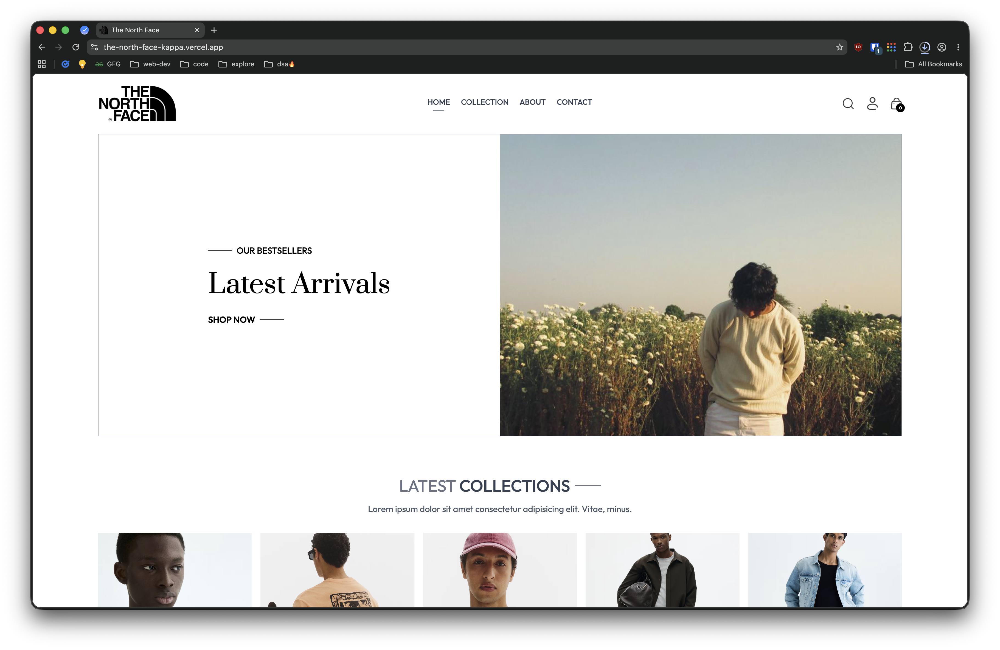
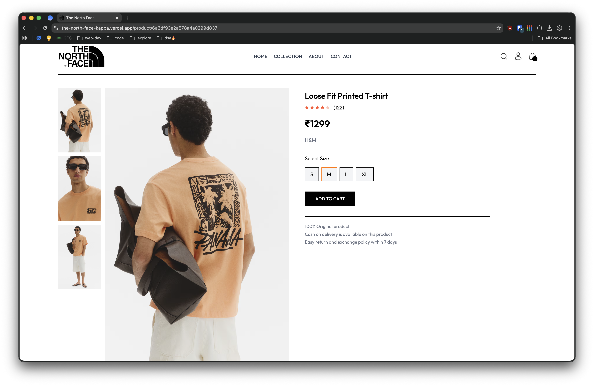
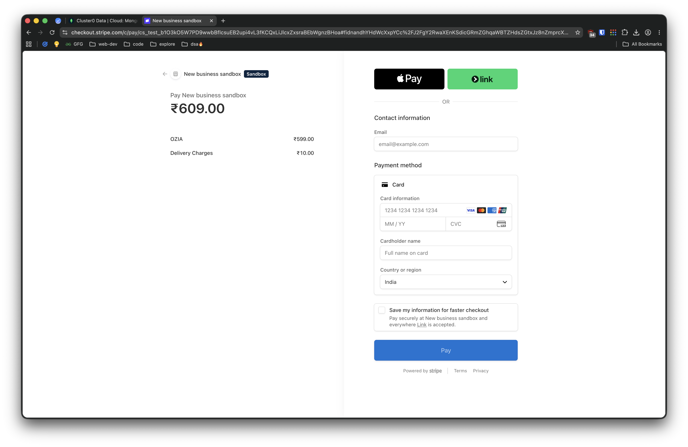

<h1 align="center">🛍️ The North Face</h1>

<p align="center">
A modern full-stack e-commerce application built with the MERN stack.
</p>

<p align="center">
  
  
  
  
  
  
</p>

---

## ✨ Features

- User Authentication
- Product Catalog
- Product Search
- Shopping Cart
- Stripe Payments
- Cash on Delivery
- Order Tracking
- Admin Dashboard
- Product Management
- Order Management
- Image Upload with Cloudinary
- Responsive Design

---

## 🛠️ Tech Stack

| Frontend | Backend | Database | Services |
|----------|----------|----------|----------|
| React | Node.js | MongoDB | Stripe |
| Vite | Express | Mongoose | Cloudinary |
| Tailwind CSS | JWT | | |

---

## 📂 Project Structure

```
theNorthFace/
│
├── frontend/
├── admin/
└── backend/
```

---

## ⚙️ Environment Variables

### Backend

```env
MONGODB_URI=
CLOUDINARY_API_KEY=
CLOUDINARY_SECRET_KEY=
CLOUDINARY_NAME=
JWT_SECRET=
ADMIN_EMAIL=
ADMIN_PASSWORD=
STRIPE_SECRET_KEY=

```

### Frontend

```env
VITE_BACKEND_URL=
```

### Admin

```env
VITE_BACKEND_URL=
```

---

## 🚀 Installation

```bash
git clone https://github.com/yourusername/theNorthFace.git

cd theNorthFace
```

Install dependencies

```bash
cd frontend
npm install

cd ../backend
npm install

cd ../admin
npm install
```

Run the project

```bash
# Backend
npm run server

# Frontend
npm run dev

# Admin
npm run dev
```

---

## 📸 Screenshots

### Homescreen

### Collection page

### Product details

### Stripe payment gateway

---
## 👨‍💻 Author

**Ankit Bhagat**

- GitHub: https://github.com/ankitsensei
- X: https://x.com/webdevankit
- LinkedIn: https://www.linkedin.com/in/ankit-bhagat-139276241/
---

<p align="center">
Made with ❤️ using the MERN Stack
</p>